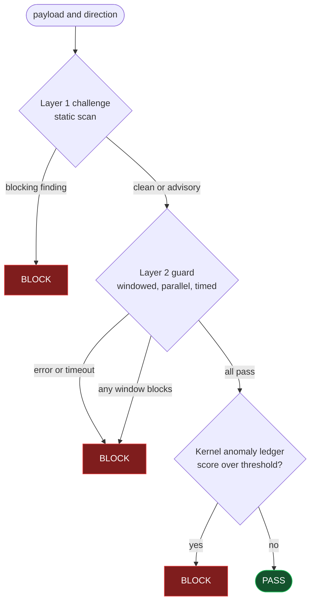
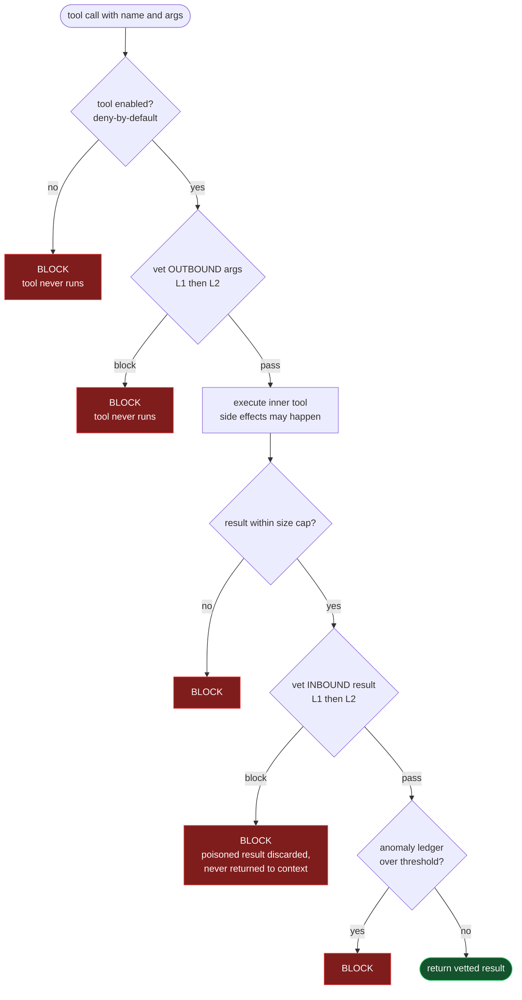

# Contextual Trust Protocol (CTP)

CTP is a zero-trust containment layer for autonomous agent systems. It sits
between the main reasoning model and its tools and checks every byte of tool
I/O, in both directions, before it can influence execution or re-enter the
model's context.

The premise is pessimistic on purpose. A language model cannot reliably tell
instructions apart from data, so no amount of prompt engineering makes the
main model safe against injection. CTP does not try. It builds external,
programmatic walls around a model it assumes is already fooled, and it keeps
the part that *executes* actions (the main model) separate from the part that
*judges* intent (a small, sandboxed guard model with no power to act).

This is defensive software. Every attack pattern in the repository is a
detection target or a test fixture.

## Status

Early. The full pipeline is implemented and tested across the process
boundary. It has not been independently audited and is not ready to protect a
production system. The Threat Model section below states plainly what it does
and does not defend against, and where the gaps are.

## How it works

CTP is a Rust workspace of five crates, arranged in layers.

```
                 +---------------------------------------------+
   tool call --> | ctp-orchestrator (L4)  gRPC gateway,        |
                 |   metrics, pipeline composition             |
                 +---------------+-----------------------------+
                                 |
        +------------------------+-------------------------+
        v                        v                         v
 +--------------+        +------------------+       +----------------+
 | ctp-challenge|        |  ctp-kernel (L3) |       |   ctp-guard    |
 |   (L1)       |        |  tool I/O wrapper|       |   (L2) separate|
 | static scan  |        |  both directions |-----> |   process, UDS |
 +--------------+        +------------------+  gRPC  |   only, no net |
        ^                        ^           over    +----------------+
        |                        |           socket
        +-------- ctp-core: typestate payloads, fail-closed errors,
                            verdict model, shared traits ----------+
```

**Layer 1, `ctp-challenge`.** A static, sub-millisecond scanner that runs
before any model is consulted. It catches encoding bypasses (nested
base64/hex/percent with decode-bomb depth caps), unicode homoglyph,
zero-width, and bidi tricks, and plaintext patterns loaded from config
(prompt exfiltration, role reassignment, instruction override). New rules are
added in TOML, no recompile.

**Layer 2, `ctp-guard`.** A separate process reachable only over a Unix
domain socket, with no network access (enforced by its systemd unit, not by
config). It runs a small local model whose only output channel is a verdict,
constrained at the sampler by a GBNF grammar and re-checked by a strict
fail-closed parser. It can classify but cannot act, and it keeps no state
between requests. A deterministic mock backend is the default for tests; the
real llama.cpp backend is behind a feature flag.

**Layer 3, `ctp-kernel`.** Middleware that wraps any tool executor and checks
both the outbound arguments (before the tool runs) and the inbound result
(before it returns to context). A per-session anomaly ledger with decay and a
floor catches slow-burn attacks that no single turn would block.

**Layer 4, `ctp-orchestrator`.** Composes the layers into one `evaluate`
entry point, exposes a tonic gRPC gateway, dials the guard over the socket,
and records per-layer Prometheus metrics.

**`ctp-core`.** Shared types. A payload typestate (`Tainted`, `Challenged`,
`Vetted`) makes pipeline order a compile-time property: only a `Vetted`
payload can release its bytes, and the only public way to advance a payload is
to run a real scanner. The error model is total and fail-closed. Every error
maps to a BLOCK decision; there is no fallible path to PASS.

### The pipeline decision

How a payload moves through the gateway's `evaluate`. Every branch that is not
a clean pass ends in BLOCK, including each failure mode (this is the fail-closed
funnel).



### A tool call, both directions

How the kernel wraps a tool call. The outbound block stops the tool before it
runs; the inbound block is the core guarantee, where the tool already ran but
its poisoned result is discarded before it can re-enter the model's context.



## Quick start (end-to-end with a real model)

Two commands take a fresh Linux install to a reproducible benchmark. This works
on any Linux with bash (Ubuntu, Debian, Fedora, Arch, openSUSE, Alpine, and
WSL2); `setup.sh` adapts its dependency hints to your package manager. The
first command checks dependencies, downloads a small GGUF model, builds the
llama-backed guard, and writes a local config. The second runs the guard and
orchestrator and pushes a payload corpus through the gateway.

```sh
./scripts/setup.sh          # deps, model, build, config
./scripts/bench.sh          # run guard + orchestrator, measure, write results
```

For GPU acceleration (strongly recommended; CPU inference is multi-second per
verdict):

```sh
GUARD_FEATURES=llama,vulkan ./scripts/setup.sh
```

Both scripts read their settings from the environment (model path and URL,
features, ports, socket path, corpus files). `bench.sh` writes
`bench-results.md` and `bench-results.csv`, and cleans up the processes on
exit. Edit the corpus in `payloads/benign.txt` and `payloads/injections.txt`,
one payload per line.

## Build and test (no model needed)

The default test suite is hermetic. It uses the mock guard backend, downloads
nothing, and needs no network.

```sh
cargo test --workspace
cargo clippy --workspace --all-targets -- -D warnings
cargo fmt --check
```

The real guard backend (`--features llama` on `ctp-guard`) builds llama.cpp
natively and needs `libclang` and `cmake`. It is not part of the default
suite.

```sh
LIBCLANG_PATH=/path/to/libclang cargo check -p ctp-guard --features llama
```

It has been run against real models (Qwen2.5-0.5B and 3B); see
[`docs/benchmarks/`](docs/benchmarks/2026-06-cpu-qwen.md). The headline result:
CPU inference is several seconds per verdict, well over the 500 ms budget and
not viable inline, so a GPU backend (`vulkan`, `rocm`, or `cuda`) is in
practice required. Detection scaled with model size and matched the threat
model's prediction. The 0.5B was not usable; even the 3B was inconsistent (it
flagged an attack and then passed it).

## Running

```sh
ctp-guard /etc/ctp/ctp.toml
ctp-orchestrator /etc/ctp/ctp.toml
```

Configuration is one TOML file with deny-by-default semantics. Unknown keys
are rejected, tools are denied unless explicitly enabled, the guard backend
must be chosen on purpose, and listeners bind to loopback. See
`ctp.toml.example`.

The guard is meant to run under the provided systemd unit
(`deploy/ctp-guard.service`), which enforces the air gap
(`PrivateNetwork=yes`, `RestrictAddressFamilies=AF_UNIX`), a read-only
filesystem with one writable runtime directory for the socket, a memory
ceiling, and a watchdog that restarts a wedged inference loop.

## Threat Model

### What CTP defends against

CTP defends the agent against compromised **data**: prompt injection and
context poisoning that arrive through tool arguments and, above all, tool
results and external data that flow back into the model's context. The inbound
direction is the main case. It is the recursive poisoning vector, where a tool
result carries an instruction that hijacks the next step.

Within that scope it provides static detection of known obfuscation and
injection classes, a second sandboxed model that judges contextual integrity
with no power to act on its judgment, both-direction interception so a
poisoned result is blocked before it reaches the model even though the tool
already ran, deny-by-default tool access, and fail-closed behavior on every
error, timeout, or transport loss.

### What CTP does not defend against

CTP protects compromised **data**, not compromised **code** or a compromised
**host**.

**Malicious code in the same address space.** The in-process guarantees (the
payload typestate, the encapsulated report construction) defend against
engineering mistakes such as skipping a layer or promoting an unvetted
payload. They do not stop an attacker who already runs code inside the
orchestrator process. Such an attacker can read the bytes directly, forge a
report, or call the inner tool without the wrapper. The real boundary against
a deliberate in-process bypass is the guard's separate sandboxed process, not
the type system.

**A compromised host OS or kernel.** CTP trusts the operating system it runs
on. If the kernel, the systemd sandbox, or the Unix socket layer is subverted,
the air gap and process isolation that make Layer 2 trustworthy no longer
hold. There is no hardware root of trust.

Hardware TEE and TPM are future work, not present today, for three reasons.
First, they change the trust model from "trust the host OS" to "trust the
silicon vendor and the attestation chain," which an operator should choose on
purpose rather than inherit. Second, confidential-computing enclaves for local
inference (sealed memory, remote attestation of the guard binary and weights)
are a project of their own. Third, shipping a TEE story before the software
boundaries above are audited would be a vault door on a tent. The honest order
is to harden and audit the OS-level containment first, then consider
attestation.

### Known open gaps

These were found during construction and are stated plainly. None are
hypothetical; each is a real limit of the current code.

1. **The gateway evaluates; the kernel enforces; they are not the same path
   yet.** The orchestrator's gRPC `evaluate` endpoint runs the full pipeline
   and returns a verdict, but it does not execute tools. The enforcement that
   intercepts tool I/O lives in `ctp-kernel`'s `KernelWrapper`, which is not
   wired into the gateway and is currently unmetered. An operator using the
   gateway gets evaluation without enforcement; one embedding the wrapper gets
   enforcement without metrics. A transparent tool-proxy mode (the planned MCP
   interceptor) or instrumenting the wrapper path is required before any
   production claim.

2. **The anomaly score is process-local and ephemeral.** The multi-turn ledger
   lives in the orchestrator's memory. Its floor stops a long benign stretch
   from erasing suspicion within a session, but it does not survive a restart
   and does not correlate across sessions. An attacker who spreads one
   borderline payload per session, or who can force a restart, resets the score
   and bypasses multi-turn detection. Durable, cross-session state is needed
   before this holds against a patient attacker.

3. **The guard is a small model; GBNF guarantees form, not judgment.** The
   grammar guarantees the shape of the output (a binary verdict, never prose)
   but cannot make the judgment correct. A small model is fallible and can be
   talked past, and Layer 1 must by design let through grammatically clean
   prose that carries a semantic intent shift with no encoding, homoglyph, or
   known phrase, or it would block ordinary tool output. So the detection
   ceiling is set by the guard model's quality, and a subtle, well-formed
   injection can pass both layers. CTP narrows the attack surface; it does not
   remove it.

   Confirmed empirically. A Qwen2.5-0.5B guard, tested in isolation, passed a
   plain prompt-exfiltration attack, and a 3B flagged a "developer mode" attack
   and then returned PASS. Two of those specific phrasings are now caught at
   Layer 1, so the layered system still stops them, but that is the point: the
   guard is the only line against an injection with no Layer 1 signature, and a
   small model is weak there. A capable guard model, or a fine-tuned
   classifier, is a prerequisite for relying on Layer 2.

4. **The report encapsulation prevents accidents, not intent.** Making
   `LayerReport` construction crate-private and routing it through real
   scanners stops a developer from accidentally promoting an unvetted payload.
   It does not stop code that deliberately wants to bypass a layer from inside
   the same process. It is a guardrail, not a wall.

### Failure posture

Where ambiguity meets a decision, CTP blocks: guard unreachable, guard
timeout, off-contract guard output, oversize payload, missing config, parse
failure, an unknown enum on the wire. A block costs a retry; a wrong pass costs
a compromise. The guard process is built to crash hard (`panic=abort`) and let
systemd restart it rather than limp on in an undefined state.

## Provenance

CTP was built with AI assistance. The architecture and the security decisions
(the layering, the trust boundaries, the fail-closed posture, the trade-offs
recorded above) are the author's. The implementation was done agentically,
step by step, with each step stopped at a manual checkpoint and reviewed before
the next began. The open gaps in the Threat Model came out of those reviews.

AI assistance is not a substitute for a security audit. An independent review
is recommended before CTP is relied on to protect anything that matters.

## License

To be determined. Until a license is added, no rights are granted. The code is
readable but not yet licensed for use, modification, or redistribution.
